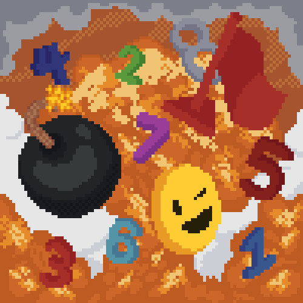

# **פרויקט מסכם בהנדסת תוכנה - 5 יח"ל**
### איתמר פרץ כהן - ת.ז REDACTED

## פיצ'רים:
- המשחק עצמו: גריד של משבצות בגודל משתנה בהתאם לרמת הקושי המכילים מאחוריהם פצצות, אריחי מספר או אריחים ריקים 🟦
- שמירת היסטוריית משחקים והצגתה ברשימה עם פרסוס (parsing) של המידע החי 📜
- רשימת שיאים אישיים והצגתם בטבלת שיאים עבור כל רמת קושי 🏆
- פורטל פרופיל אישי ואפשרות ליצור שם שיופיע בטבלת השיאים - Nickname 🧍
- מסך סטטיסטיקות על המשתמש והמשחקים שלו 📊
- מערכת נקודות בהתאם לרמת קושי וזמנים 💯
- חנות אביזרים ושדרוגים (שימוש בנקודות) 🛒
- אינוונטורי: אחסון ושימוש האייטמים (פופאפ) 🎒
- מערכת הישגים - אצ'יומנטים 🥇
- ספלאש סקרין מותאם אישית עם הלוגו של המשחק, שם המשחק וקרדיט (קטן) 💥
- מערכת משתמשים: רישום לפי מייל וסיסמה - מסך להרשמה ומסך לכניסה 🔑
- אופציה לשחק בתור אורח ללא צורך בהרשמה (לא ניתן לגשת לחלק נרחב מהפונקציונליות של המשחק) 👽
- מערכת חברים - אופציה להוסיף חברים ולראות את הניקוד שלהם, לשלוח בקשות חברות - לאשר ולדחות בקשות 🤝
- מסך חוקים ללמידת המשחק 📋
- מערכת התראות - נוטיפיקציות ❗
- סגנון פרוייקט בעיצוב אישי (פיקסל ארט ופלטת צבעים מותאמת) 👾
- אנימציות לחיצה על כפתורים - 🖱️
- מסכי פופ-אפ לבחירת רמת קושי והתראה על ניצחון / הפסד 💢
- מסכי טעינה בין מסכים 🫷
- שירות הודעות: שיתוף תוצאות משחק דרך מייל / הודעות / ווטסאפ... 📞
- התראות יומיות: כל יום ב-19:00 בערב המשחק ישלח התראה לשחק ⏲️
- סרביס של מוזיקת רקע ופיצוצים 🎶
- מסך הגדרות עם אפשרות לכבות את המוזיקה ואת ההתראות היומיות ⚙️

## מסכים כהיררכיה (השקעתי)
- ספלאש סקרין (מסך קופץ) ראשוני 💥
- מסך ההמתנה 🫷
- מסך הרשמה כמשתמש 🔑
- מסך כניסה למשתמש רשום או כאורח 🔑
  - מסך ראשי (תפריט)
    - מסך חוקים 📋
    -  מסך ההגדרות ⚙️
    - מסך רמת הקושי (פופ-אפ)
    - מסך החנות 🛒
    - מסך הפרופיל - 🧍
      - מסך הסטטיסטיקות 📊
      - מסך ההישגים (אצ'יומנטים) 🥇
      - מסך בקשות החברות 🙏
    - מסך משחק 🎲
      - מסך טבלת השיאים 🏆
      - מסך היסטוריית המשחקים 📜
      - מסך האינוונטורי (פופ-אפ) 🎒

### **הפרוייקט הזה נכתב ב-6 ימים, בעזרת 30 קומיטים ומפתח עצבני אחד!**

## תודות מיוחדות:
- עיצוב גרפי מותאם אישית - אורי בשקין
- מוזיקת רקע - "Jorel" 

## כל הזכויות שמורות לאיתמר (מי שגונב מניאק) © © © © © ©
